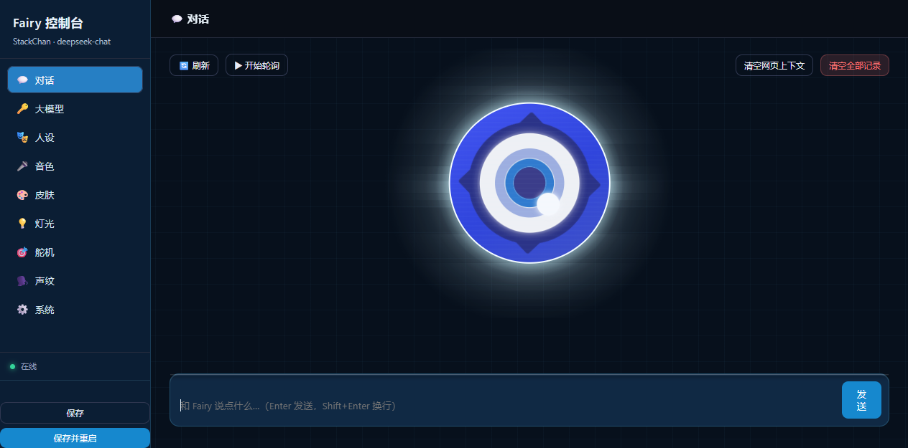

# 网页控制台使用说明（电脑 `/admin` · 手机 `/m`）

> 控制台是**你自建服务器**上的网页，跑在 `http_port`（默认 **8003**）上。
> 用法一句话：**同一 WiFi 下用浏览器打开就能用**，手机上也是。

**长这样**（这是首页 = 「💬 对话」页签，刚装好、还没开始对话时的样子）：



左侧是 9 个页签（对话 / 大模型 / 人设 / 音色 / 皮肤 / 灯光 / 舵机 / 声纹 / 系统）+「保存 / 保存并重启」，
中间那只发光的眼睛就是 **Fairy 的脸**（控制台里用 SVG 实时画的，会随对话状态变），
下方是聊天区（也能在这里直接跟 Fairy 打字）。手机端是另一套布局（底部 4 个页签），见 §3。

---

## 0. 先看这里（四条）

```text
① 控制台不用单独「搭建」
   它就是【服务器改动的一部分】：打完 INSTALL §1.2 的补丁、起服务，
   /admin（电脑）和 /m（手机）就自动有了 —— 没有额外的安装步骤。
   （原理：http_server.py 启动时 admin_handler.register(app) 挂上这两个路由）

② 控制台在服务器上，不在设备上
   ⇒ 服务器没跑，或者设备连不上服务器，控制台都打不开/看不到设备状态

③ ★ 只允许【局域网】访问
   放行：本机 + 10.x / 192.168.x / 172.16-31.x（手机连同一个 WiFi 就能开）
   拒绝：公网 IP ⇒ 返回 403

④ ⛔ 没有登录 / 密码 / token
   ⇒ 能访问到这个地址的人，就能改你的大模型 Key、人设、音色、皮肤
   ⇒ 只在内网用，**别把这个端口映射到公网**；要外网访问请用
      【反向代理 + HTTP 基础认证】或 VPN

⑤ 端口：**默认 8003，但没写死**
   · 控制台跑在配置里的 `server.http_port`（设备用 WebSocket 连的是 `server.port`，默认 8000）
   · 你在浏览器里用什么端口访问，控制台就用那个端口拼给设备的地址
     （按请求的 Host 头自适应；Host 不带端口时才读配置，都没有才兜底 8003 并打印告警）
   · 改过端口 ⇒ 把端口写全（`http://<IP>:<你的端口>/...`），
     或在配置里补 `server.http_port: <你的端口>`
   · **设备端也不写死 8003**：优先用记住的地址 → 其次从当前 OTA 地址里取端口 → 最后才兜底 8003
```

**打开方式**

```text
电脑：http://<服务器IP>:8003/admin
手机：http://<服务器IP>:8003/m        （同一 WiFi）
```

---

## 1. 电脑版：9 个页签

侧栏点页签切换；底部常驻 **「保存」/「保存并重启」** 和服务器连接状态灯。

| 页签 | 干什么 | 生效方式 |
|---|---|---|
| 💬 **对话** | 直接打字和 Fairy 聊天（Enter 发送 / Shift+Enter 换行）；旁边是会动的眼睛，随状态变（idle / thinking / speaking）；下面是对**话记录**（可「暂停轮询」减少请求） | 立即 |
| 🔑 **大模型** | 模型名（有个「探测」按钮能列出这个服务商可用的模型）、Base URL、API Key、温度、最大回复长度 | 保存后**重启** |
| 🎭 **人设** | Fairy 的 system prompt（人设） | 保存后**重启** |
| 🎤 **音色** | 参考音频（能从 `fairy-ref` 目录里**下拉选**）、参考文本、**试听**（手机端没有试听） | 保存后**重启** |
| 🎨 **皮肤** | 两张卡片：**Fairy**（全屏 GIF，连你的自建服务器）⇄ **官方几何脸**（连官方服务器） | **需重启**（约 10 秒） |
| 💡 **灯光** | 12 颗 RGB 的 7 种状态颜色：待机（呼吸）/ 连接中（呼吸）/ 聆听（常亮）/ 说话（常亮）/ 通知 / 错误 / 升级；另有「立即应用 / 恢复默认」 | **实时生效** |
| 🎯 **舵机** | 摇杆一次调横纵，或分别调 **左右 yaw（-128~128）/ 俯仰 pitch（3~87）**；「立即应用 / 回中 / 设为默认角度」；下面还有「🐾 待机自动转头」开关 | **实时生效** |
| 🗣️ **声纹** | **说话人列表**（每人显示「已注册 / 未注册」）+ **➕ 添加说话人**（ID / 名字 / 描述）+ **🎙️ 录音注册**（用浏览器录 6 秒）+ **🗑️ 删除声纹** | **实时生效**（加完人**不用重启**，设备下次对话就认） |
| ⚙️ **系统** | 配置（当前值）/ 备份（**每次保存自动备份到 `backup/`，可回滚**）/ 说明 | — |

> ★ **实时生效 vs 需重启**：灯光、舵机、开关类是**点了立刻动**；
> 大模型、人设、音色、皮肤属于配置项，**保存后要重启**才生效 ——
> 用侧栏底下那个 **「保存并重启」** 一次搞定。
>
> ▸ 眼睛那个动效来自参考项目 Fairy-DSH（Apache-2.0），署名见
> [`THIRD-PARTY-LICENSES.md`](THIRD-PARTY-LICENSES.md)。

---

## 2. 手机版：4 个页签（`/m`）

同一个服务器、同一份配置，只是版式换成单列大按钮，**去掉音色试听**（手机浏览器不好放音）。

| 页签 | 里面有什么 |
|---|---|
| **对话** | 消息列表 + 输入框（发送）+ **刷新** / **清空网页上下文** / **清空全部记录** |
| **形象** | 皮肤（Fairy / 官方几何脸）+ 灯光（7 种状态色）+ 舵机（yaw / pitch + 回中 / 设为默认） |
| **设置** | 大模型 + 人设 Prompt + 音色（参考音频路径 / 参考文本）+ 开关（待机转头） |
| **设备** | 设备状态 + 服务器地址（Fairy / 官方）+ 操作（**重启服务器** / 重新读取配置） |

> 「清空网页上下文」= 只清网页这边的记录；
> 「清空全部记录」= **服务器侧也清**（设备下次对话不会带上之前的上下文）。

---

## 3. 常见疑问

| 现象 | 原因 / 怎么办 |
|---|---|
| 开关点一下，刷新又跳回去 | 服务器下发成功但没落盘（本项目已修：`_persist_hw_value`）；自己改过代码要照做 |
| 显示「设备未连接服务器」 | 设备没连上 ⇒ 看串口有没有 `WS: Connecting to ws://…`，或按 [`INSTALL.md`](INSTALL.md) §3 填 OTA 地址 |
| 改了没生效 | 看那个开关标的是「实时生效」还是「需重启」——**需重启的要点「保存并重启」** |
| 音色试听没声 | ① 服务器那台机器要能出声 ② 浏览器允许自动播放 ③ **手机端本来就没有试听** |
| 打不开控制台 | ① 服务器在跑吗（`http://<IP>:8003/admin` 是否 200）② 同一 WiFi 吗 ③ 公网访问会被 403 |
| 参考音频下拉是空的 | 把 wav 放到 **`<服务器 clone 的上一级>/fairy-ref/`**（见 [`voice-package/README.md`](voice-package/README.md) §5.3） |
| 皮肤切换后服务器配置没同步 | 设备切皮肤时会在 OTA 里上报，服务器自动对齐（见 [`server/README.md`](server/README.md)） |
| 声纹「开始录音」没反应 / 没成功 | ① 麦克风**只在 `http://127.0.0.1:8003/admin`（本机 localhost）或 https 下**可用；用局域网 IP 打开时浏览器不给麦克风，录音按钮会变灰显示「录音不可用（此地址）」② 现在每一步都有提示（申请权限 → 倒计时 → 上传中 → ✅/❌ 具体原因），照着那行字查 |
| 加了人，设备还是不认识 | ① 列表里那个人要显示**「已注册」** —— 只「添加」不「录音」是认不出的 ② 声纹服务在跑吗（`GET http://127.0.0.1:8005/voiceprint/health?key=<token>`）③ 详见 [`server/README.md`](server/README.md) 的声纹一节 |

---

## 4. 想自己写脚本？控制台 API

控制台就是这些接口的壳，你可以直接调（都在 `server/patches/core/api/admin_handler.py`）：

```text
GET  /admin/api/state       状态灯（idle / thinking / speaking）
GET  /admin/api/device      设备是否在线 + 基本信息
GET  /admin/api/config      当前配置
GET  /admin/api/models      大模型 / 视觉模型的配置（含"探测可用模型"）
GET  /admin/api/refs        参考音频目录列表
POST /admin/api/hw_apply    硬件下发（RGB / 舵机 / 转头 / 跟随）
POST /admin/api/skin        切皮肤
POST /admin/api/chat        网页对话
POST /admin/api/restart     重启服务器
GET  /admin/api/voiceprint                  说话人列表 + 各自注册状态 + 声纹服务在线状态
POST /admin/api/voiceprint/register         录音注册（multipart: speaker_id + file）
POST /admin/api/voiceprint/delete           删除某个人的声纹
POST /admin/api/voiceprint/speaker/add      新增说话人（JSON: id / name / desc）
POST /admin/api/voiceprint/speaker/remove   移除说话人（连带删掉它的声纹）
```

判据：`/admin/api/state` 能返回 JSON，说明「对话记录 + 设备注册表」都接对了
（详见 [`server/README.md`](server/README.md) 的接线与自检）。
